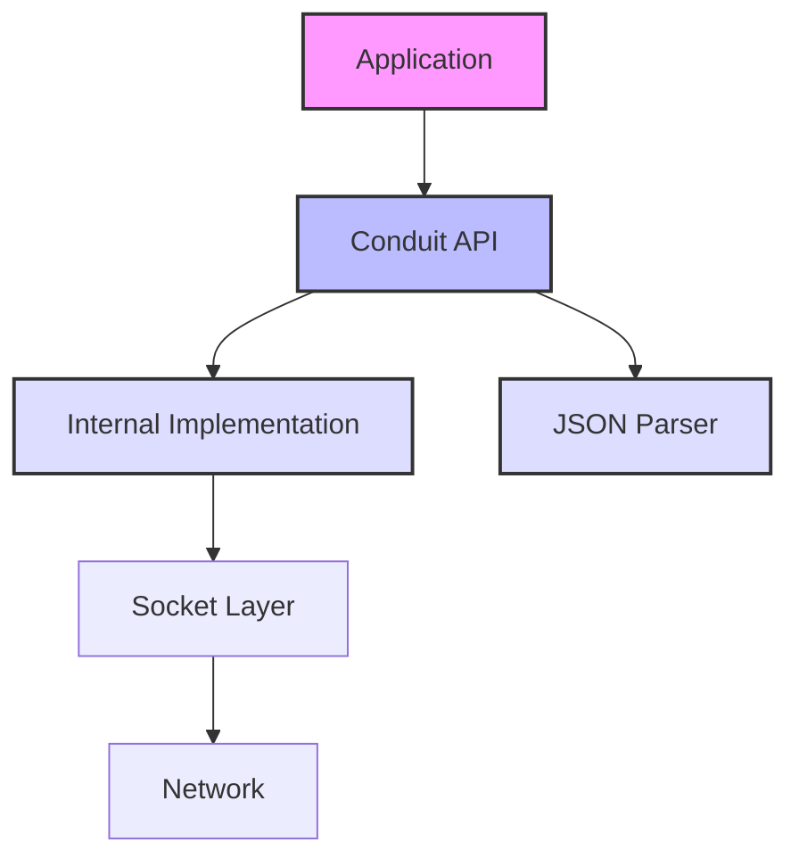
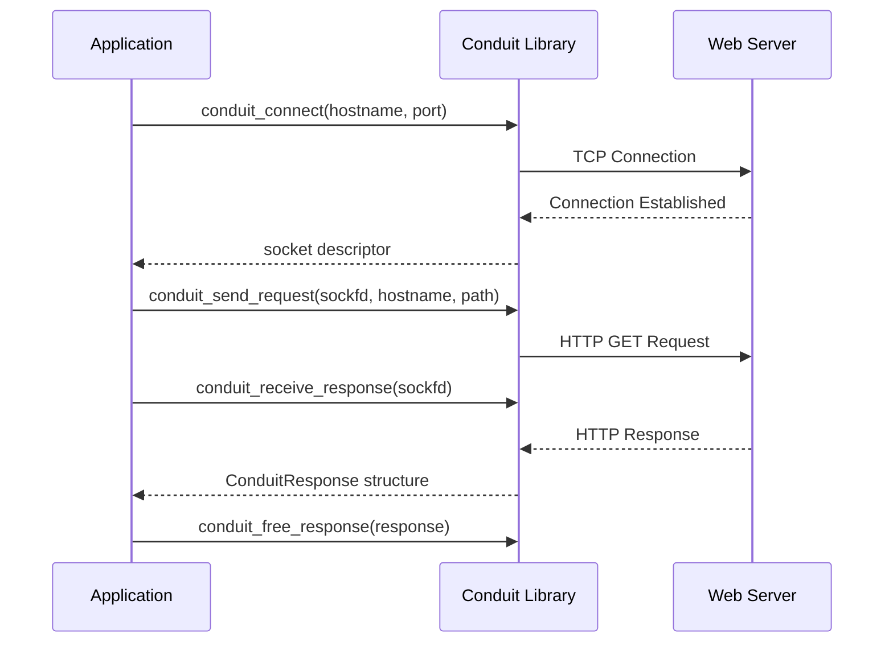
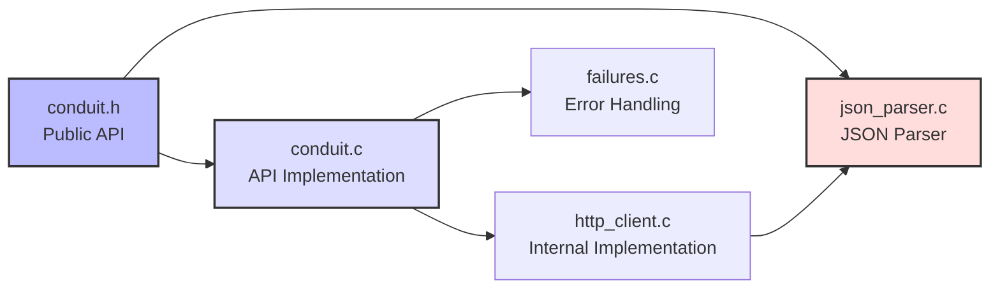

# Conduit
<p align="center">
 
</p>
A lightweight HTTP client library written in C.

## Features
- Simple API for making HTTP requests
- Support for GET requests
- Built-in JSON parsing capabilities
- Socket-based implementation with no external dependencies
- Configurable timeouts
- Detailed error reporting

## Architecture


## Requirements
- C compiler (gcc, clang, etc.)
- CMake 3.10 or higher

## Building
```bash
mkdir build
cd build
cmake ..
make
```

## How It Works


## Usage Example
```c
#include <stdio.h>
#include <conduit.h>

int main() {
    // Connect to a server
    int sockfd = conduit_connect("jsonplaceholder.typicode.com", 80);
    if (sockfd < 0) {
        fprintf(stderr, "Connection failed\n");
        return 1;
    }
    
    // Send a GET request
    if (conduit_send_request(sockfd, "jsonplaceholder.typicode.com", "/todos/1") < 0) {
        fprintf(stderr, "Failed to send request\n");
        return 1;
    }
    
    // Receive the response
    ConduitResponse* response = conduit_receive_response(sockfd);
    if (!response) {
        fprintf(stderr, "Failed to receive response\n");
        return 1;
    }
    
    // Process the response data
    printf("Status code: %d\n", response->status_code);
    
    // Parse and use JSON data if available
    if (response->json && response->json->type == JSON_OBJECT) {
        JsonObject* obj = response->json->value.object;
        
        int userId = json_get_int(obj, "userId");
        int id = json_get_int(obj, "id");
        const char* title = json_get_string(obj, "title");
        int completed = json_get_bool(obj, "completed");
        
        printf("User ID: %d\n", userId);
        printf("ID: %d\n", id);
        printf("Title: %s\n", title);
        printf("Completed: %s\n", completed ? "true" : "false");
    }
    
    // Free the response resources
    conduit_free_response(response);
    
    return 0;
}
```

## API Reference

### conduit_connect
```c
int conduit_connect(const char* hostname, int port);
```
Establishes a connection to the specified server.

**Parameters:**
- `hostname`: The server hostname or IP address
- `port`: The port number

**Returns:**
- A socket file descriptor if successful
- A negative error code if an error occurs

### conduit_send_request
```c
int conduit_send_request(int sockfd, const char* hostname, const char* path);
```
Sends an HTTP GET request to the server.

**Parameters:**
- `sockfd`: The socket file descriptor from `conduit_connect`
- `hostname`: The hostname for the Host header
- `path`: The path for the request URL

**Returns:**
- 0 if successful
- A negative error code if an error occurs

### conduit_receive_response
```c
ConduitResponse* conduit_receive_response(int sockfd);
```
Receives and processes the HTTP response.

**Parameters:**
- `sockfd`: The socket file descriptor from `conduit_connect`

**Returns:**
- A pointer to a `ConduitResponse` structure if successful
- NULL if an error occurs

### conduit_free_response
```c
void conduit_free_response(ConduitResponse* response);
```
Frees all memory allocated for a response.

**Parameters:**
- `response`: The response structure to free

### JSON Parsing Functions

```c
int json_get_int(JsonObject* obj, const char* key);
const char* json_get_string(JsonObject* obj, const char* key);
int json_get_bool(JsonObject* obj, const char* key);
```

Extract values from a parsed JSON object.

**Parameters:**
- `obj`: The JSON object to extract from
- `key`: The key to look up

**Returns:**
- The requested value if found
- Default value (0, NULL, or false) if not found or wrong type

## Response Structure

```c
typedef struct {
    int status_code;      // HTTP status code
    char* body;           // Response body as string
    char* headers;        // Response headers
    char* content_type;   // Content-Type header value
    JsonValue* json;      // Parsed JSON (if response is JSON)
} ConduitResponse;
```

## Library Structure


## License
This project is licensed under the MIT License - see the LICENSE file for details.