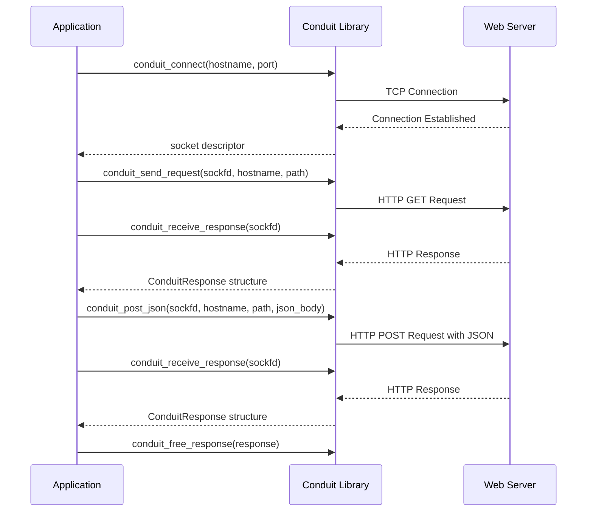

# Conduit HTTP Client Library

<p align="center">
 
</p>

A powerful and flexible HTTP client library available in both **C** and **modern C++** implementations. Choose the version that best fits your project's needs.

## Quick Start

### C Version (Original)
```c
#include <conduit.h>

int main() {
    int sockfd = conduit_connect("httpbin.org", 80);
    if (sockfd > 0) {
        conduit_send_request(sockfd, "httpbin.org", "/get");
        ConduitResponse* response = conduit_receive_response(sockfd);
        printf("Status: %d\n", response->status_code);
        conduit_free_response(response);
    }
    return 0;
}
```

### C++ Version (Modern)
```cpp
#include <conduit.hpp>

int main() {
    try {
        conduit::HttpClient client;
        auto response = client.get("http://httpbin.org/get");
        std::cout << "Status: " << response.status_code() << std::endl;
    } catch (const conduit::HttpException& e) {
        std::cerr << "Error: " << e.what() << std::endl;
    }
    return 0;
}
```

## Table of Contents

- [Features](#features)
- [Installation](#installation)
- [Usage Examples](#usage-examples)
- [API Reference](#api-reference)
- [Building from Source](#building-from-source)
- [Testing](#testing)
- [Contributing](#contributing)
- [License](#license)

## Features

### Common Features (Both Versions)
- **HTTP GET/POST Requests** - Full HTTP/1.1 support
- **JSON Support** - Built-in JSON parsing and serialization
- **No External Dependencies** - Uses only standard libraries
- **Cross-Platform** - Works on Linux, macOS, and other POSIX systems
- **Lightweight** - Minimal footprint and fast performance
- **Configurable Timeouts** - Set custom request timeouts
- **Detailed Error Handling** - Comprehensive error reporting

### C Version Features
- **C99 Compatible** - Works with older compilers
- **Simple API** - Straightforward function-based interface
- **Manual Memory Management** - Full control over resources
- **Small Binary Size** - Optimized for embedded systems

### C++ Version Features
- **Modern C++17** - Uses latest C++ features
- **RAII Resource Management** - Automatic cleanup
- **Exception Safety** - Proper error handling with exceptions
- **STL Integration** - Works with standard containers
- **Type Safety** - Compile-time type checking
- **Persistent Connections** - Reuse connections for multiple requests
- **Smart Pointers** - Memory-safe by design

## 🛠 Installation

### Quick Installation (Recommended)

#### C Version
```bash
# Clone the repository
git clone https://github.com/fernkit/conduit.git
cd conduit

# Run the C installation script
./install-c.sh
```

#### C++ Version
```bash
# Clone the repository
git clone https://github.com/fernkit/conduit.git
cd conduit

# Run the C++ installation script
./install-cpp.sh
```

### Manual Installation

#### C Version
```bash
mkdir build-c && cd build-c
cmake .. -DCMAKE_BUILD_TYPE=Release
make
sudo make install
sudo ldconfig  # Linux only
```

#### C++ Version
```bash
mkdir build-cpp && cd build-cpp
# Temporarily use the C++ CMakeLists.txt
cp ../CMakeLists-cpp.txt ../CMakeLists.txt
cmake .. -DCMAKE_BUILD_TYPE=Release
make
sudo make install
sudo ldconfig  # Linux only
```

## Usage Examples

### C Version Examples

#### Basic GET Request
```c
#include <conduit.h>
#include <stdio.h>

int main() {
    int sockfd = conduit_connect("jsonplaceholder.typicode.com", 80);
    if (sockfd < 0) {
        printf("Connection failed\n");
        return 1;
    }
    
    if (conduit_send_request(sockfd, "jsonplaceholder.typicode.com", "/posts/1") < 0) {
        printf("Request failed\n");
        return 1;
    }
    
    ConduitResponse* response = conduit_receive_response(sockfd);
    if (response) {
        printf("Status: %d\n", response->status_code);
        printf("Body: %s\n", response->body);
        
        // Parse JSON response
        if (response->json) {
            JsonObject* obj = response->json->value.object;
            const char* title = json_get_string(obj, "title");
            int userId = json_get_int(obj, "userId");
            
            printf("Title: %s\n", title);
            printf("User ID: %d\n", userId);
        }
        
        conduit_free_response(response);
    }
    
    return 0;
}
```

#### POST Request with JSON
```c
#include <conduit.h>

int main() {
    int sockfd = conduit_connect("jsonplaceholder.typicode.com", 80);
    if (sockfd < 0) return 1;
    
    const char* json_body = "{"
        "\"title\": \"My Post\","
        "\"body\": \"This is a test post\","
        "\"userId\": 1"
    "}";
    
    if (conduit_post_json(sockfd, "jsonplaceholder.typicode.com", "/posts", json_body) == 0) {
        printf("POST successful\n");
    }
    
    return 0;
}
```

## Project Structure

```
conduit/
├── include/          # Public header files
│   ├── conduit.h     # Main library interface
│   ├── failures.h    # Error handling definitions
│   ├── http_client.h # HTTP client implementation
│   └── json_parser.h # JSON parsing utilities
├── src/              # Implementation files
│   ├── conduit.c
│   ├── failures.c
│   ├── http_client.c
│   └── json_parser.c
├── examples/         # Example applications
│   ├── simple_get.c
│   └── simple_post.c
├── cmake/            # CMake configuration files
│   └── conduit-config.cmake.in
├── conduit.pc.in     # pkg-config template
└── install.sh        # Installation script
```

## Building from Source

```bash
mkdir build
cd build
cmake ..
make
```

## How It Works


## Usage Examples

### GET Request Example
```c
#include <stdio.h>
#include <conduit.h>

int main() {
    // Connect to a server
    int sockfd = conduit_connect("jsonplaceholder.typicode.com", 80);
    if (sockfd < 0) {
        fprintf(stderr, "Connection failed\n");
        return 1;
    }
    
    // Send a GET request
    if (conduit_send_request(sockfd, "jsonplaceholder.typicode.com", "/todos/1") < 0) {
        fprintf(stderr, "Failed to send request\n");
        return 1;
    }
    
    // Receive the response
    ConduitResponse* response = conduit_receive_response(sockfd);
    if (!response) {
        fprintf(stderr, "Failed to receive response\n");
        return 1;
    }
    
    // Process the response data
    printf("Status code: %d\n", response->status_code);
    
    // Parse and use JSON data if available
    if (response->json && response->json->type == JSON_OBJECT) {
        JsonObject* obj = response->json->value.object;
        
        int userId = json_get_int(obj, "userId");
        int id = json_get_int(obj, "id");
        const char* title = json_get_string(obj, "title");
        int completed = json_get_bool(obj, "completed");
        
        printf("User ID: %d\n", userId);
        printf("ID: %d\n", id);
        printf("Title: %s\n", title);
        printf("Completed: %s\n", completed ? "true" : "false");
    }
    
    // Free the response resources
    conduit_free_response(response);
    
    return 0;
}
```

### POST Request Example
```c
#include <stdio.h>
#include <conduit.h>

int main() {
    // Connect to a server
    int sockfd = conduit_connect("jsonplaceholder.typicode.com", 80);
    if (sockfd < 0) {
        fprintf(stderr, "Connection failed\n");
        return 1;
    }
    
    // Prepare JSON data to send
    const char* json_body = "{\"title\":\"foo\",\"body\":\"bar\",\"userId\":1}";
    
    // Send a POST request with JSON data
    if (conduit_post_json(sockfd, "jsonplaceholder.typicode.com", "/posts", json_body) < 0) {
        fprintf(stderr, "Failed to send POST request\n");
        return 1;
    }
    
    // Receive the response
    ConduitResponse* response = conduit_receive_response(sockfd);
    if (!response) {
        fprintf(stderr, "Failed to receive response\n");
        return 1;
    }
    
    // Process the response data
    printf("Status code: %d\n", response->status_code);
    printf("Response body: %s\n", response->body);
    
    // Free the response resources
    conduit_free_response(response);
    
    return 0;
}
```

## API Reference

### conduit_connect
```c
int conduit_connect(const char* hostname, int port);
```
Establishes a connection to the specified server.

**Parameters:**
- `hostname`: The server hostname or IP address
- `port`: The port number

**Returns:**
- A socket file descriptor if successful
- A negative error code if an error occurs

### conduit_send_request
```c
int conduit_send_request(int sockfd, const char* hostname, const char* path);
```
Sends an HTTP GET request to the server.

**Parameters:**
- `sockfd`: The socket file descriptor from `conduit_connect`
- `hostname`: The hostname for the Host header
- `path`: The path for the request URL

**Returns:**
- 0 if successful
- A negative error code if an error occurs

### conduit_post_json
```c
int conduit_post_json(int sockfd, const char* hostname, const char* path, const char* json_body);
```
Sends an HTTP POST request with a JSON body to the server.

**Parameters:**
- `sockfd`: The socket file descriptor from `conduit_connect`
- `hostname`: The hostname for the Host header
- `path`: The path for the request URL
- `json_body`: The JSON data to send as a string

**Returns:**
- 0 if successful
- A negative error code if an error occurs

### conduit_receive_response
```c
ConduitResponse* conduit_receive_response(int sockfd);
```
Receives and processes the HTTP response.

**Parameters:**
- `sockfd`: The socket file descriptor from `conduit_connect`

**Returns:**
- A pointer to a `ConduitResponse` structure if successful
- NULL if an error occurs

### conduit_free_response
```c
void conduit_free_response(ConduitResponse* response);
```
Frees all memory allocated for a response.

**Parameters:**
- `response`: The response structure to free

### JSON Parsing Functions

```c
int json_get_int(JsonObject* obj, const char* key);
const char* json_get_string(JsonObject* obj, const char* key);
int json_get_bool(JsonObject* obj, const char* key);
JsonValue* conduit_parse_json(const char* json_string);
```

Extract values from a parsed JSON object or parse a JSON string.

**Parameters:**
- `obj`: The JSON object to extract from
- `key`: The key to look up
- `json_string`: The JSON string to parse

**Returns:**
- The requested value if found
- Default value (0, NULL, or false) if not found or wrong type
- Parsed JSON value pointer for `conduit_parse_json`

### JSON Creation Functions

```c
JsonValue* json_create_null();
JsonValue* json_create_boolean(int boolean_value);
JsonValue* json_create_number(double number_value);
JsonValue* json_create_string(const char* string_value);
JsonValue* json_create_object();
```

Create JSON values for building JSON data structures.

**Returns:**
- A pointer to a new JsonValue structure of the specified type

## Response Structure

```c
typedef struct {
    int status_code;      // HTTP status code
    char* body;           // Response body as string
    char* headers;        // Response headers
    char* content_type;   // Content-Type header value
    JsonValue* json;      // Parsed JSON (if response is JSON)
} ConduitResponse;
```

## Error Handling

The library provides detailed error reporting via error codes and messages:

```c
typedef enum {
    ERR_HOSTNAME_RESOLUTION,
    ERR_SOCKET_CREATION,
    ERR_SEVER_CONNECTION,
    ERR_SEND_HTTP_REQ,
    ERR_BUFF_OVERFLOW,
    ERR_RECEIVING_DATA
} ErrorCode;

const char* get_error_message(ErrorCode code);
```

## License
This project is licensed under the MIT License - see the LICENSE file for details.