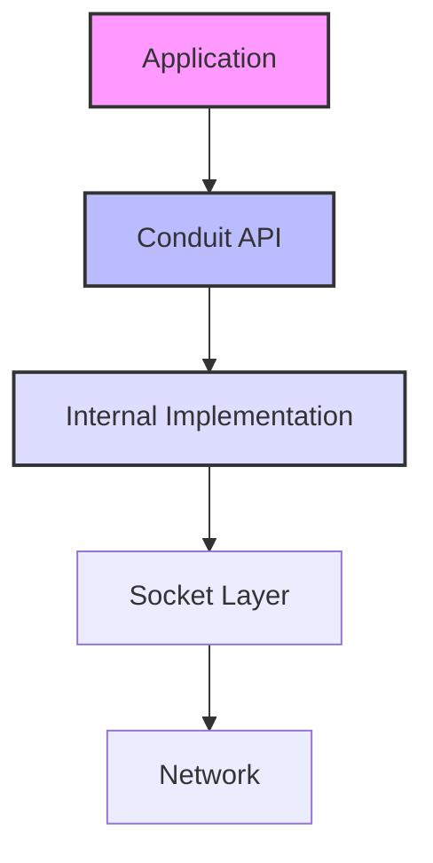
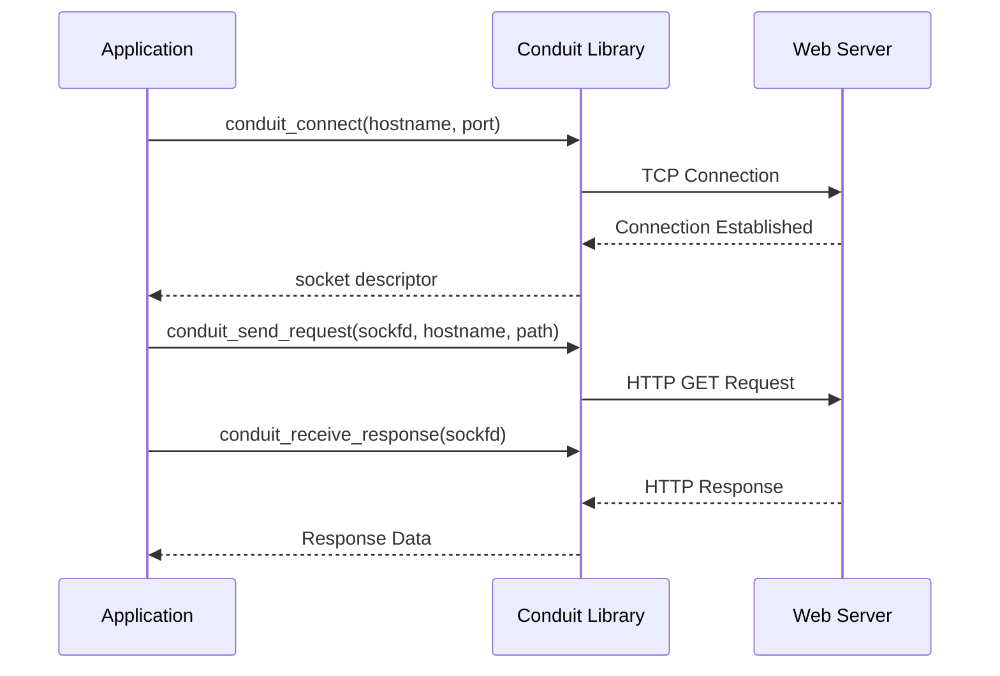
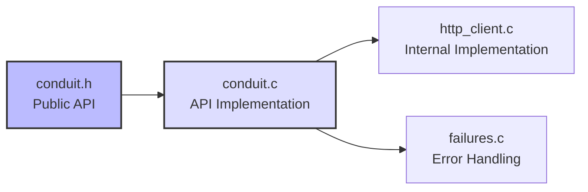

# Conduit

<p align="center">
  
</p>

A lightweight HTTP client library written in C.

## Features

- Simple API for making HTTP requests
- Support for GET requests
- Socket-based implementation with no external dependencies
- Configurable timeouts
- Detailed error reporting

## Architecture



## Requirements

- C compiler (gcc, clang, etc.)
- CMake 3.10 or higher

## Building

```bash
mkdir build
cd build
cmake ..
make
```

## How It Works




## Usage Example

```c
#include <stdio.h>
#include <conduit.h>

int main() {
    // Connect to a server
    int sockfd = conduit_connect("jsonplaceholder.typicode.com", 80);
    if (sockfd < 0) {
        printf("Connection failed: %s\n", conduit_strerror(sockfd));
        return 1;
    }

    // Send a GET request
    if (conduit_send_request(sockfd, "jsonplaceholder.typicode.com", "/todos/1") < 0) {
        printf("Failed to send request\n");
        return 1;
    }

    // Receive and display the response
    conduit_receive_response(sockfd);

    return 0;
}
```
## API Reference

### conduit_connect

```c
int conduit_connect(const char* hostname, int port);
```

Establishes a connection to the specified server.

**Parameters:**
- `hostname`: The server hostname or IP address
- `port`: The port number

**Returns:**
- A socket file descriptor if successful
- A negative error code if an error occurs

### conduit_send_request

```c
int conduit_send_request(int sockfd, const char* hostname, const char* path);
```

Sends an HTTP GET request to the server.

**Parameters:**
- `sockfd`: The socket file descriptor from `conduit_connect`
- `hostname`: The hostname for the Host header
- `path`: The path for the request URL

**Returns:**
- 0 if successful
- A negative error code if an error occurs

### conduit_receive_response

```c
int conduit_receive_response(int sockfd);
```

Receives and displays the HTTP response.

**Parameters:**
- `sockfd`: The socket file descriptor from `conduit_connect`

**Returns:**
- 0 if successful
- A negative error code if an error occurs

## Library Structure



## License

This project is licensed under the MIT License - see the LICENSE file for details.

